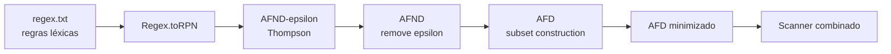
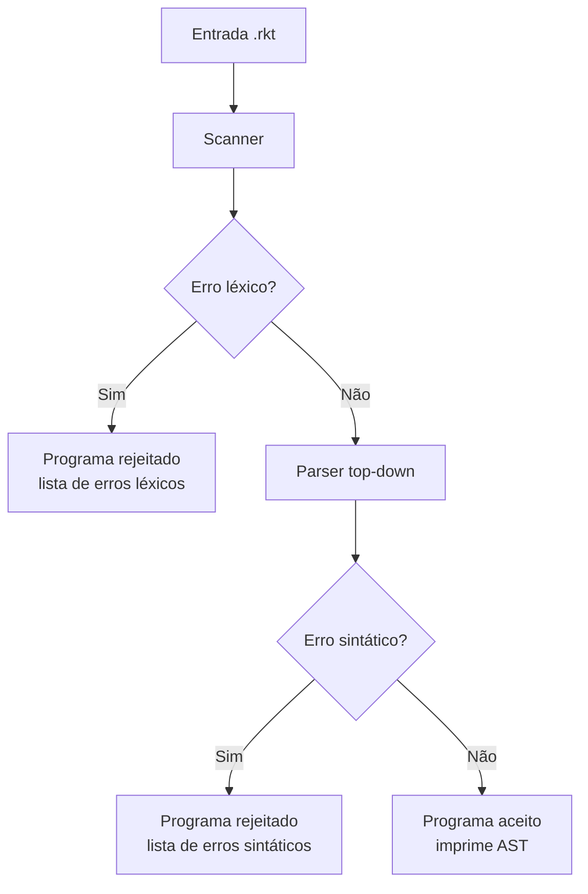
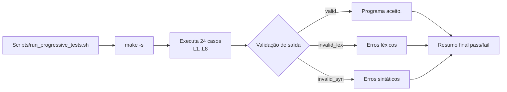

# Gerador de Scanner + Parser Top-Down para Racket

Este repositório implementa a **1ª entrega** do trabalho de compiladores:

- Gerador de scanner a partir de expressões regulares
- Parser top-down (descendente recursivo) para uma linguagem escolhida

A linguagem escolhida neste projeto é **Racket**.

## O que foi implementado

### 1. Gerador de scanner

Entrada:
- Arquivo `regex.txt` com regras no formato `<TOKEN> expressao_regular`

Saída:
- Scanner capaz de tokenizar um programa Racket

Características:
- Pipeline completo de construção de autômatos:
  - Regex -> AFND-ε -> AFND -> AFD -> AFD minimizado
- Regra de **maximal munch** (maior casamento possível)
- Desempate por **prioridade de regra** (ordem em `regex.txt`)
- Suporte a tokens ignoráveis (`WHITESPACE`, `COMMENT`, `NEWLINE`)
- Erro léxico com **linha/coluna** para símbolos inválidos

### 2. Parser top-down

Entrada:
- Lista de tokens produzida pelo scanner

Saída:
- AST (árvore sintática) quando o programa é aceito
- Lista de erros sintáticos quando rejeitado

Escopo coberto:
- Expressões gerais
- Formas especiais:
  - `define`
  - `lambda`
  - `if`
  - `cond`
  - `let`
- Chamada de função
- Literais (número, string, booleano)

Tratamento de erro:
- Recuperação com sincronização
- Coleta de múltiplos erros (não para no primeiro)

## Estrutura principal

- `Model/` -> autômatos, regex, scanner, token
- `Controller/` -> gerador de scanner, parser, árvore sintática
- `main.cpp` -> fluxo completo CLI (scanner + parser)
- `regex.txt` -> regras léxicas
- `Examples/` -> casos válidos e inválidos

## Diagramas de funcionamento

### 1) Geração do scanner (pipeline de autômatos)



### 2) Execução principal (scanner + parser)



### 3) Bateria progressiva de testes



## Requisitos

- `g++` com suporte a C++17
- `make`

## Compilação

```bash
make clean
make
```

Executável gerado:

```bash
./compilador_racket
```

## Execução

### Arquivo padrão

```bash
./compilador_racket
```

Usa `programa.rkt` por padrão.

### Arquivo específico

```bash
./compilador_racket Examples/L1_valid.rkt
```

## Exemplos disponíveis

### Bateria progressiva (8 níveis)

- Diretório: `Examples/`
- Formato por nível:
  - `L<N>_valid.rkt`
  - `L<N>_invalid_lex.rkt`
  - `L<N>_invalid_syn.rkt`
- Matriz de cobertura: `Docs/progressive_matrix.md`

## Formato do `regex.txt`

Cada linha de regra deve seguir:

```text
<TOKEN> expressao_regular
```

Exemplo:

```text
<KEYWORD_DEFINE> define
<INTEGER> -?[0-9]+
<LPAREN> \(
<RPAREN> \)
```

Linhas vazias e linhas iniciadas com `;` são ignoradas.

## Saída esperada

### Caso aceito

- Mensagem `Programa aceito.`
- Impressão da AST

### Caso rejeitado

- Mensagem `Programa rejeitado.`
- Lista de erros com contexto (linha/coluna/token)

## Entregáveis atendidos

- Código fonte
- Makefile e instruções de compilação/execução
- Arquivos de exemplo

## Testes progressivos

Comando único:

```bash
make test-progressive
```

Ou diretamente:

```bash
bash Scripts/run_progressive_tests.sh
```

O script:
- compila o projeto
- executa 24 casos (8 níveis x 3 cenários)
- valida por saída esperada (`Programa aceito.`, `Erros léxicos`, `Erros sintáticos`)
- imprime resumo final com pass/fail e lista de falhas
